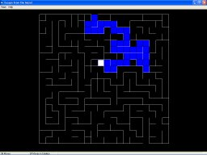



## A Maze Maker \- Generates Cool Mazes \<\- \!

### Description

This code will generate a maze, which you can then play. Designed for fun, but as a complete application.

Uses good programming style and has some very interesting recusive functions that are used to build the maze. Check the screenshot, and please post any feedback you have!

- Ben
 
### More Info
 

             |
---                |---
**Submitted On**   |2002-11-11 00:05:24
**By**             |[Ben Whitney](https://github.com/Planet-Source-Code/PSCIndex/blob/master/ByAuthor/ben-whitney.md)
**Level**          |Intermediate
**User Rating**    |5.0 (55 globes from 11 users)
**Compatibility**  |VB 5\.0, VB 6\.0
**Category**       |[Complete Applications](https://github.com/Planet-Source-Code/PSCIndex/blob/master/ByCategory/complete-applications__1-27.md)
**World**          |[Visual Basic](https://github.com/Planet-Source-Code/PSCIndex/blob/master/ByWorld/visual-basic.md)
**Archive File**   |[A\_Maze\_Mak14952311112002\.zip](https://github.com/Planet-Source-Code/ben-whitney-a-maze-maker-generates-cool-mazes__1-40601/archive/master.zip)

